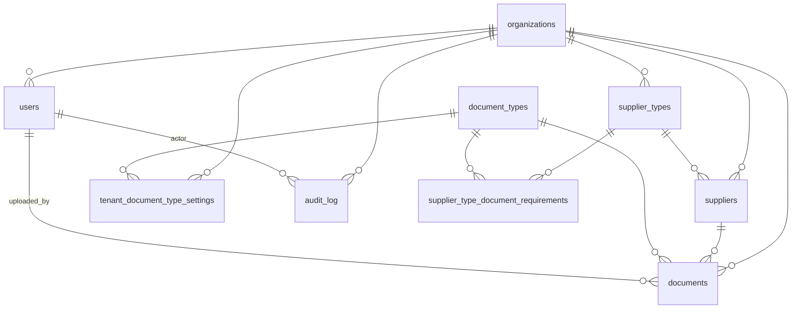

# Phase 1 Data Model: Bóveda de Cumplimiento REPSE (Core)

Modelo relacional para MySQL 8.0 con SQLAlchemy 2.x. Todas las tablas con datos de cliente llevan `organization_id` NOT NULL + índice + relación a `organizations.id`.

## Convenciones globales

- **PK**: `id BIGINT UNSIGNED AUTO_INCREMENT PRIMARY KEY` en todas las entidades.
- **Timestamps**: `created_at TIMESTAMP(6) NOT NULL DEFAULT CURRENT_TIMESTAMP(6)`, `updated_at TIMESTAMP(6) NOT NULL DEFAULT CURRENT_TIMESTAMP(6) ON UPDATE CURRENT_TIMESTAMP(6)`. Se exponen como `datetime` en Pydantic.
- **Soft-delete cuando aplica**: `deleted_at TIMESTAMP(6) NULL` (nullable). Defaults SQLAlchemy `event.listens_for` excluyen registros soft-deleted en queries por mixin `SoftDeleteMixin`.
- **Charset**: `utf8mb4` con collation `utf8mb4_0900_ai_ci`.
- **Convención de nombres**: snake_case, plural en tablas (`suppliers`, `documents`).
- **Naming convention SQLAlchemy** (para que Alembic genere nombres deterministas):

  ```python
  naming_convention = {
      "ix": "ix_%(column_0_label)s",
      "uq": "uq_%(table_name)s_%(column_0_name)s",
      "ck": "ck_%(table_name)s_%(constraint_name)s",
      "fk": "fk_%(table_name)s_%(column_0_name)s_%(referred_table_name)s",
      "pk": "pk_%(table_name)s",
  }
  ```

- **Multi-tenant**: mixin `TenantOwned(Base)` agrega `organization_id` + FK + índice. Toda Select sobre tablas tenant-owned pasa por un `before_compile` event listener que inserta `WHERE organization_id = :current_tenant_id` salvo que el contexto sea `with_admin_scope()`.

---

## Entidad: `Organization` (Tenant)

| Columna | Tipo | Restricciones | Notas |
|---------|------|---------------|-------|
| `id` | BIGINT UNSIGNED | PK | |
| `legal_name` | VARCHAR(255) | NOT NULL | Razón social |
| `rfc` | VARCHAR(13) | NOT NULL UNIQUE | RFC del cliente contratante |
| `contact_email` | VARCHAR(255) | NOT NULL | Punto de contacto principal |
| `expiring_soon_threshold_days` | SMALLINT UNSIGNED | NOT NULL DEFAULT 15 | FR-013 del spec |
| `timezone` | VARCHAR(64) | NOT NULL DEFAULT 'America/Mexico_City' | |
| `status` | ENUM('active','grace','deleted') | NOT NULL DEFAULT 'active' | FR-015a/b |
| `grace_until` | DATE | NULL | Si status='grace', fecha en que vence la gracia (created_at + 90d) |
| `created_at`/`updated_at` | TIMESTAMP(6) | | |
| `deleted_at` | TIMESTAMP(6) | NULL | |

**Índices**: `uq_organizations_rfc` (RFC único globalmente).

**Reglas**:
- `status='grace'` lo establece el flujo de baja; un cron diario marca como `deleted` (y borra files) cuando `grace_until < today`.
- `status='deleted'` mantiene la fila como tombstone para la bitácora; los datos relacionados ya no existen.

---

## Entidad: `User`

| Columna | Tipo | Restricciones | Notas |
|---------|------|---------------|-------|
| `id` | BIGINT UNSIGNED | PK | |
| `organization_id` | BIGINT UNSIGNED | NOT NULL FK → organizations.id | Tenant owner |
| `email` | VARCHAR(255) | NOT NULL | Normalizado a lowercase |
| `oidc_subject` | VARCHAR(255) | NULL | `sub` del IDP (única por provider) |
| `oidc_provider` | ENUM('google','microsoft') | NULL | |
| `display_name` | VARCHAR(255) | NOT NULL | |
| `role` | ENUM('admin','manager','viewer') | NOT NULL | FR-004 del spec |
| `status` | ENUM('active','disabled') | NOT NULL DEFAULT 'active' | |
| `last_login_at` | TIMESTAMP(6) | NULL | |
| `created_at`/`updated_at` | TIMESTAMP(6) | | |

**Índices**:
- `uq_users_email` (`organization_id`, `email`) — un correo único por organización (un mismo correo puede pertenecer a distintos tenants si el caso lo requiere; por defecto en v1, una persona = una organización).
- `uq_users_oidc` (`oidc_provider`, `oidc_subject`).

---

## Entidad: `Supplier`

| Columna | Tipo | Restricciones | Notas |
|---------|------|---------------|-------|
| `id` | BIGINT UNSIGNED | PK | |
| `organization_id` | BIGINT UNSIGNED | NOT NULL FK | TenantOwned |
| `supplier_type_id` | BIGINT UNSIGNED | NOT NULL FK → supplier_types.id | FR-005a. Si el usuario no especifica al crear, se asigna el `SupplierType` "Sin clasificar" del tenant. |
| `legal_name` | VARCHAR(255) | NOT NULL | Razón social del proveedor |
| `rfc` | VARCHAR(13) | NOT NULL | |
| `contact_name` | VARCHAR(255) | NULL | |
| `contact_email` | VARCHAR(255) | NULL | |
| `contact_phone` | VARCHAR(32) | NULL | |
| `status` | ENUM('active','inactive') | NOT NULL DEFAULT 'active' | |
| `notes` | TEXT | NULL | |
| `created_at`/`updated_at` | TIMESTAMP(6) | | |
| `deleted_at` | TIMESTAMP(6) | NULL | |

**Índices**:
- `uq_suppliers_org_rfc` (`organization_id`, `rfc`) — RFC único por organización (FR-006).
- `ix_suppliers_org_status` (`organization_id`, `status`).
- `ix_suppliers_org_supplier_type` (`organization_id`, `supplier_type_id`) — soporta filtros por tipo en dashboard (spec 005) y al recalcular cumplimiento.

**Reglas de validación** (Pydantic):
- RFC formato `^[A-ZÑ&]{3,4}\d{6}[A-Z0-9]{3}$`, normalizado a mayúsculas.
- Al menos uno de `contact_email` o `contact_phone` cuando `status='active'`.

---

## Entidad: `SupplierType` (catálogo de tipos de proveedor)

Tipos de proveedor (industrias) por tenant. Su administración detallada vive en spec 003 (extendido).

| Columna | Tipo | Restricciones | Notas |
|---------|------|---------------|-------|
| `id` | BIGINT UNSIGNED | PK | |
| `organization_id` | BIGINT UNSIGNED | NOT NULL FK | TenantOwned |
| `name` | VARCHAR(120) | NOT NULL | p. ej. "Construcción", "Sin clasificar" |
| `description` | TEXT | NULL | |
| `origin` | ENUM('system','custom') | NOT NULL DEFAULT 'custom' | `system` SOLO para "Sin clasificar" auto-sembrado |
| `status` | ENUM('active','archived') | NOT NULL DEFAULT 'active' | |
| `created_at`/`updated_at` | TIMESTAMP(6) | | |

**Índices**:
- `uq_supplier_types_org_name` (`organization_id`, lower(`name`)) — unicidad por tenant insensible a mayúsculas (spec 003 FR-014).
- `ix_supplier_types_org_status` (`organization_id`, `status`).
- `uq_supplier_types_system_per_org` parcial (`organization_id`) WHERE `origin='system'` — un único "Sin clasificar" por tenant (en MySQL no hay índice parcial nativo; se enforza vía constraint lógico + trigger o validación de aplicación).

**Reglas**:
- `origin='system'` NO se puede crear ni eliminar desde la UI; lo siembra una operación de bootstrap del tenant.
- `status='archived'` con proveedores asociados es válido: la UI marca los proveedores como "tipo archivado, reclasificar"; el indicador agregado del tenant los cuenta de forma especial (ver spec 003 edge case).

---

## Entidad: `SupplierTypeDocumentRequirement` (asociación tipo de proveedor ↔ tipo de documento)

Define qué documentos exige cada `SupplierType` y con qué periodicidad efectiva.

| Columna | Tipo | Restricciones | Notas |
|---------|------|---------------|-------|
| `id` | BIGINT UNSIGNED | PK | |
| `organization_id` | BIGINT UNSIGNED | NOT NULL FK | TenantOwned (denormalizado desde `supplier_types`; permite scoping multi-tenant a nivel ORM). |
| `supplier_type_id` | BIGINT UNSIGNED | NOT NULL FK → supplier_types.id | |
| `document_type_id` | BIGINT UNSIGNED | NOT NULL FK → document_types.id | |
| `periodicity_override` | ENUM('monthly','bimonthly','annual','none') | NULL | NULL = hereda del `DocumentType`. Valor concreto = override (spec 001 FR-012b, D4). |
| `status` | ENUM('active','retired') | NOT NULL DEFAULT 'active' | `retired` mantiene auditoría sin contar como requisito. |
| `created_at`/`updated_at` | TIMESTAMP(6) | | |
| `created_by` | BIGINT UNSIGNED | NULL FK → users.id | |

**Índices**:
- `uq_supplier_type_doc_req` (`supplier_type_id`, `document_type_id`) — un requisito por par (tipo de proveedor, tipo de documento). Reactivar un `retired` previo se hace por UPDATE, no por INSERT.
- `ix_supplier_type_doc_req_org` (`organization_id`).

**Reglas**:
- `document_types.status` debe ser `active` cuando se crea o reactiva la asociación (spec 003 FR-021). Si el `DocumentType` se desactiva después, la asociación queda con `status='active'` pero el cálculo de cumplimiento la ignora hasta que el tipo se reactive (no se borra ni se mueve a `retired` automáticamente).
- `organization_id` se valida en aplicación: debe coincidir con `supplier_types.organization_id` y (para canónicos) con la cobertura del catálogo del tenant.

---

## Entidad: `DocumentType` (catálogo canónico)

Esta tabla guarda **el catálogo canónico maestro** (visible para todos los tenants). La administración por tenant (activar/desactivar/agregar personalizados) vive en spec 003; en este spec solo se consume.

| Columna | Tipo | Restricciones | Notas |
|---------|------|---------------|-------|
| `id` | BIGINT UNSIGNED | PK | |
| `slug` | VARCHAR(64) | NOT NULL UNIQUE | p. ej. `opinion-sat` |
| `name` | VARCHAR(255) | NOT NULL | |
| `description` | TEXT | NULL | |
| `periodicity` | ENUM('monthly','bimonthly','annual','none') | NOT NULL | |
| `origin` | ENUM('canonical','custom') | NOT NULL DEFAULT 'canonical' | |
| `organization_id` | BIGINT UNSIGNED | NULL FK | NULL para canónicos; set para personalizados del tenant (spec 003) |
| `status` | ENUM('active','archived') | NOT NULL DEFAULT 'active' | |
| `created_at`/`updated_at` | TIMESTAMP(6) | | |

**Índices**:
- `uq_document_types_org_name` (`organization_id`, `name`) — nombre único por organización; NULL en canónicos.
- `ix_document_types_origin_status` (`origin`, `status`).

---

## Entidad: `TenantDocumentTypeSetting`

Activa/desactiva un tipo canónico dentro de un tenant. Crea filas perezosamente: si no existe la fila, el canónico se asume **activo** para tenants nuevos (FR-007 del spec) y **inactivo** cuando se agrega un canónico nuevo a una org existente (spec 003 FR-012).

| Columna | Tipo | Restricciones |
|---------|------|---------------|
| `id` | BIGINT UNSIGNED | PK |
| `organization_id` | BIGINT UNSIGNED | NOT NULL FK |
| `document_type_id` | BIGINT UNSIGNED | NOT NULL FK |
| `active` | BOOLEAN | NOT NULL |
| `last_changed_by` | BIGINT UNSIGNED | NULL FK → users.id |
| `last_changed_at` | TIMESTAMP(6) | NULL |

**Índices**:
- `uq_tdts_org_type` (`organization_id`, `document_type_id`).

---

## Entidad: `Document`

| Columna | Tipo | Restricciones | Notas |
|---------|------|---------------|-------|
| `id` | BIGINT UNSIGNED | PK | |
| `organization_id` | BIGINT UNSIGNED | NOT NULL FK | TenantOwned |
| `supplier_id` | BIGINT UNSIGNED | NOT NULL FK | |
| `document_type_id` | BIGINT UNSIGNED | NOT NULL FK | |
| `coverage_period_start` | DATE | NULL | Solo cuando periodicidad != 'none' |
| `coverage_period_end` | DATE | NULL | Calculado a partir del start + periodicidad |
| `due_date_calculated` | DATE | NULL | Resultado de `expiration.compute_due_date` |
| `due_date_effective` | DATE | NULL | Override manual; si NULL prevalece `due_date_calculated` |
| `due_date_override_reason` | VARCHAR(255) | NULL | Captura la razón del override |
| `status` | ENUM('valid','expiring_soon','expired','missing') | NOT NULL | Calculado por trigger lógico al guardar/recalcular; **derivado**, también recalculable por job |
| `verified` | BOOLEAN | NOT NULL DEFAULT FALSE | FR-012a |
| `verified_by` | BIGINT UNSIGNED | NULL FK → users.id | |
| `verified_at` | TIMESTAMP(6) | NULL | |
| `verified_note` | VARCHAR(500) | NULL | |
| `version` | SMALLINT UNSIGNED | NOT NULL DEFAULT 1 | Incrementa al sustituir |
| `is_latest` | BOOLEAN | NOT NULL DEFAULT TRUE | Solo el último por (supplier, type, period) tiene TRUE |
| `last_updated_by` | BIGINT UNSIGNED | NULL FK → users.id | Último usuario **humano** que modificó el documento (FR-011a, FR-011e). NULL si no ha habido cambios humanos desde la carga inicial. |
| `last_updated_at` | TIMESTAMP(6) | NULL | Fecha-hora del último cambio humano. NULL si no ha habido cambios. **Distinta** de `updated_at` (auto, refleja cualquier escritura del ORM, incluso del sistema). |
| `file_path` | VARCHAR(1024) | NOT NULL | Relativo a `UPLOAD_ROOT` |
| `file_name_original` | VARCHAR(255) | NOT NULL | |
| `file_size_bytes` | BIGINT UNSIGNED | NOT NULL | |
| `file_mime_type` | VARCHAR(127) | NOT NULL | |
| `file_sha256` | CHAR(64) | NOT NULL | Hex; detecta duplicados |
| `ocr_status` | ENUM('not_run','pending','success','failed') | NOT NULL DEFAULT 'not_run' | |
| `ocr_extracted_rfc` | VARCHAR(13) | NULL | |
| `ocr_extracted_issued_at` | DATE | NULL | |
| `ocr_extracted_valid_until` | DATE | NULL | |
| `ocr_raw_text` | MEDIUMTEXT | NULL | Texto completo para futuras búsquedas |
| `uploaded_by` | BIGINT UNSIGNED | NOT NULL FK → users.id | |
| `created_at`/`updated_at` | TIMESTAMP(6) | | |
| `deleted_at` | TIMESTAMP(6) | NULL | |

**Índices**:
- `ix_documents_org_supplier_type_period` (`organization_id`, `supplier_id`, `document_type_id`, `coverage_period_start`).
- `ix_documents_org_due` (`organization_id`, `due_date_effective`) — para alertas / "por vencer".
- `ix_documents_org_status` (`organization_id`, `status`).
- `uq_documents_org_sha256` (`organization_id`, `file_sha256`) — detecta duplicados exactos por tenant.
- `ix_documents_org_last_updated` (`organization_id`, `last_updated_at`) — soporta sort y filtros por "última modificación humana".

**Reglas / state machine**:
- `status = "missing"` NO se almacena como fila concreta — es derivado al consultar (si un tipo activo del tenant no tiene Document `is_latest=TRUE` para el periodo, cuenta como missing).
- `last_updated_by` / `last_updated_at` SOLO se actualizan ante acciones humanas (sustitución de versión, override de vencimiento, verificación/anulación de verificación, edición de metadatos). Las acciones del sistema (OCR, recálculo de estado, jobs) NUNCA tocan estos campos; sus eventos viven exclusivamente en `audit_log` con `actor_user_id = NULL`. Esto se asegura en el `service.py` de documentos: las funciones que escriben desde una sesión sin usuario no acceden a estos campos.
- `status` de filas reales se calcula con la regla:

  ```python
  due = due_date_effective or due_date_calculated
  if due is None:
      return "valid"   # sin vigencia
  if today > due:
      return "expired"
  if (due - today).days <= org.expiring_soon_threshold_days:
      return "expiring_soon"
  return "valid"
  ```

- Para garantizar consistencia entre lectura y escritura, el `status` se materializa al guardar y se recalcula con un job diario (`recalc_status_for_organization`) que invalida filas afectadas por cambio de umbral u override manual.

---

## Entidad: `DocumentVersionHistory`

Histórico opcional para queries de auditoría sin tener que `WHERE is_latest=FALSE` en `documents`.

> Decisión: **no crear esta tabla por separado en v1**. Usar la misma tabla `documents` con `version` + `is_latest` cubre el caso y evita duplicar tablas. Se introduce solo si el costo de los índices con `is_latest` empieza a doler.

---

## Entidad: `AuditLog`

| Columna | Tipo | Restricciones | Notas |
|---------|------|---------------|-------|
| `id` | BIGINT UNSIGNED | PK | |
| `organization_id` | BIGINT UNSIGNED | NOT NULL FK | TenantOwned |
| `actor_user_id` | BIGINT UNSIGNED | NULL FK → users.id | NULL para acciones del sistema |
| `action` | VARCHAR(64) | NOT NULL | p. ej. `supplier.created`, `document.uploaded` |
| `entity_type` | VARCHAR(64) | NOT NULL | p. ej. `supplier`, `document` |
| `entity_id` | BIGINT UNSIGNED | NULL | Puede ser NULL para acciones globales del tenant |
| `metadata` | JSON | NOT NULL | Datos previos/nuevos, IP, user-agent, etc. |
| `created_at` | TIMESTAMP(6) | NOT NULL DEFAULT CURRENT_TIMESTAMP(6) | Inmutable; **no hay** `updated_at` |

**Índices**:
- `ix_audit_org_created` (`organization_id`, `created_at`).
- `ix_audit_entity` (`entity_type`, `entity_id`).

**Reglas**:
- Esta tabla es **append-only**: no se permite UPDATE ni DELETE excepto cuando la organización pasa a `status='deleted'` (purga total tras 90 días de gracia).
- Las acciones críticas que **deben** generar AuditLog se listan en FR-015 del spec.

---

## Diagrama de relaciones (Mermaid)



---

## Migrations iniciales (Alembic)

1. `0001_baseline.py` — crea `organizations`, `users`, `supplier_types`, `suppliers`, `document_types`, `tenant_document_type_settings`, `supplier_type_document_requirements`, `documents`, `audit_log` con todos los índices y FKs.
2. `0002_seed_canonical_catalog.py` — `op.bulk_insert` con las filas canónicas del [research.md §9](./research.md).
3. `0003_org_provisioning_hook.py` — define la función de bootstrap del tenant que se invoca al crear cada `Organization`:
   - Crea `SupplierType` "Sin clasificar" con `origin='system'`.
   - Inserta `SupplierTypeDocumentRequirement` para "Sin clasificar" apuntando a TODOS los `DocumentType` canónicos activos del tenant, con `periodicity_override = NULL` (hereda).
   - Asegura que cualquier `Organization` nueva quede operativa sin necesidad de configuración manual.

Cada migration debe tener `downgrade()` reversible. La constitución lo exige.

---

## Reglas de aislamiento multi-tenant (revisión obligatoria pre-merge)

Una checklist específica que cualquier PR que toque la capa de datos debe pasar:

- [ ] Modelo nuevo: ¿hereda de `TenantOwned`? Si no, ¿está justificado (p. ej. `DocumentType` canónico global)?
- [ ] Query nueva en `service.py`: ¿el filtro de tenant viene del `current_tenant` dependency, no de un parámetro de URL?
- [ ] Test de integración negativo: ¿hay un caso donde el usuario de Org A intenta acceder a un recurso de Org B y obtiene 404?
- [ ] Migration nueva: ¿la columna `organization_id` es NOT NULL y tiene índice?
