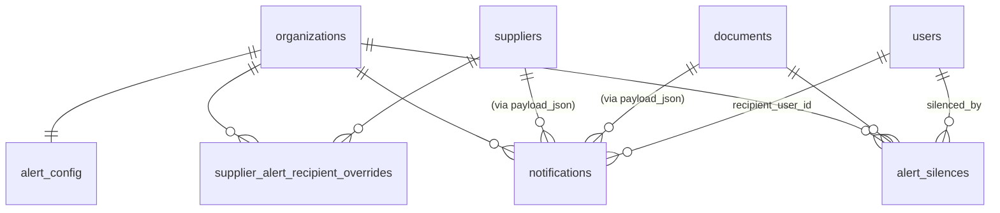

# Phase 1 Data Model: Alertas y Recordatorios de Cumplimiento

Modelo aditivo: cuatro tablas nuevas en MySQL 8.0, ningún cambio a las del 001. Todas las tablas son TenantOwned (FK + filtro `organization_id`).

Las convenciones globales (charset, naming, mixins) se heredan del [data-model del 001](../001-repse-compliance-tracker/data-model.md).

---

## Entidad: `AlertConfig`

Una fila por organización. Se crea durante el provisioning del tenant (extender el bootstrap del 001).

| Columna | Tipo | Restricciones | Notas |
|---------|------|---------------|-------|
| `id` | BIGINT UNSIGNED | PK | |
| `organization_id` | BIGINT UNSIGNED | NOT NULL UNIQUE FK | Una sola config por tenant (uno a uno). |
| `expiring_lead_time_days` | SMALLINT UNSIGNED | NOT NULL DEFAULT 15 | Ventana "por vencer" (FR-007). 1..90. |
| `default_recipient_emails` | JSON | NOT NULL | Array de strings; mínimo 1 entrada cuando alertas habilitadas. Validado en aplicación. |
| `daily_run_at` | TIME | NOT NULL DEFAULT '08:00:00' | Hora local del tenant para ejecutar el barrido. |
| `enabled` | BOOLEAN | NOT NULL DEFAULT TRUE | Si FALSE, el scheduler no genera notificaciones para este tenant. |
| `last_run_at` | DATETIME(6) | NULL | UTC. Para idempotencia y diagnostics. |
| `last_run_status` | ENUM('success','partial','failed') | NULL | |
| `last_run_summary` | JSON | NULL | `{notifications_created, notifications_skipped, errors}` para debug. |
| `created_at`/`updated_at` | TIMESTAMP(6) | | |

**Reglas**:
- Al crear `Organization` (provisioning), se inserta `AlertConfig` con valores por defecto + `default_recipient_emails = [contact_email de la org]`.
- `expiring_lead_time_days` reemplaza al campo `expiring_soon_threshold_days` del spec 001 si lo había. Decisión: se mantiene en el 001 para `compute_status`, y este de 002 es independiente (controla la generación de la notificación). Por defecto son iguales; el spec aún no exige sincronizarlos.

---

## Entidad: `SupplierAlertRecipientOverride`

Sobrescritura por proveedor. Si existe, suplanta `AlertConfig.default_recipient_emails` solo para alertas de ese proveedor.

| Columna | Tipo | Restricciones | Notas |
|---------|------|---------------|-------|
| `id` | BIGINT UNSIGNED | PK | |
| `organization_id` | BIGINT UNSIGNED | NOT NULL FK | TenantOwned |
| `supplier_id` | BIGINT UNSIGNED | NOT NULL FK → suppliers.id | |
| `recipient_emails` | JSON | NOT NULL | Array de strings, mínimo 1. |
| `created_by` | BIGINT UNSIGNED | NULL FK → users.id | |
| `created_at`/`updated_at` | TIMESTAMP(6) | | |

**Índices**:
- `uq_supplier_alert_recipients_supplier` (`supplier_id`) — un override por proveedor.

**Reglas**:
- Si la fila existe pero `recipient_emails = []`, se trata como "silenciar todos los correos del proveedor" — fuera de alcance v1 (no se ofrece en UI). Validación rechaza array vacío.

---

## Entidad: `AlertSilence`

Silenciamiento manual por documento (FR-009). Mientras `ended_at IS NULL`, las alertas para ese documento no se envían.

| Columna | Tipo | Restricciones | Notas |
|---------|------|---------------|-------|
| `id` | BIGINT UNSIGNED | PK | |
| `organization_id` | BIGINT UNSIGNED | NOT NULL FK | TenantOwned |
| `document_id` | BIGINT UNSIGNED | NOT NULL FK → documents.id | |
| `silenced_by` | BIGINT UNSIGNED | NOT NULL FK → users.id | |
| `reason` | VARCHAR(500) | NOT NULL | Motivo capturado en UI. |
| `started_at` | TIMESTAMP(6) | NOT NULL DEFAULT CURRENT_TIMESTAMP(6) | |
| `ended_at` | TIMESTAMP(6) | NULL | NULL = vigente; valor = momento en que se levantó. |
| `ended_by` | BIGINT UNSIGNED | NULL FK → users.id | NULL hasta que se levanta. |
| `ended_reason` | ENUM('manual','document_renewed','type_retired') | NULL | Cómo terminó el silencio. |

**Índices**:
- `ix_alert_silences_active` (`organization_id`, `document_id`, `ended_at`) — soporta el filtro "¿este documento está silenciado HOY?" en el evaluador.
- Se permite tener **múltiples silenciamientos históricos** por documento; el evaluador solo considera el activo (ended_at IS NULL).

**Reglas**:
- Cuando un documento es renovado (nueva versión cargada con estado vigente), el scheduler levanta automáticamente el silencio activo (si lo hay) con `ended_reason='document_renewed'`.
- Cuando el `SupplierType` deja de exigir el tipo del documento, el silencio se cierra con `ended_reason='type_retired'`.

---

## Entidad: `Notification`

Cada notificación generada (por correo + in-app son dos filas o una fila con dos canales — ver decisión abajo).

**Decisión**: una fila por **canal**. Esto facilita el seguimiento del estado de cada canal por separado (in-app puede entregarse aunque el correo falle).

| Columna | Tipo | Restricciones | Notas |
|---------|------|---------------|-------|
| `id` | BIGINT UNSIGNED | PK | |
| `organization_id` | BIGINT UNSIGNED | NOT NULL FK | TenantOwned |
| `recipient_user_id` | BIGINT UNSIGNED | NULL FK → users.id | NULL cuando es correo externo. |
| `recipient_email` | VARCHAR(255) | NULL | NULL para in-app. |
| `channel` | ENUM('email','in_app') | NOT NULL | |
| `alert_type` | ENUM('expiring_soon','expired') | NOT NULL | |
| `payload_json` | JSON | NOT NULL | `{supplier_id, supplier_name, documents:[{id, type_name, period, due_date, days_until_due, link}]}`. Inmutable tras crear. |
| `run_date` | DATE | NOT NULL | Fecha en zona horaria del tenant para idempotencia (FR-006). |
| `status` | ENUM('pending','sent','failed','read') | NOT NULL DEFAULT 'pending' | `read` solo aplica a in-app. |
| `attempts` | SMALLINT UNSIGNED | NOT NULL DEFAULT 0 | Solo email. |
| `last_attempted_at` | DATETIME(6) | NULL | UTC. |
| `sent_at` | DATETIME(6) | NULL | UTC. NULL hasta que se envía con éxito. |
| `error_message` | TEXT | NULL | Solo cuando `status='failed'`. |
| `read_at` | DATETIME(6) | NULL | Solo aplica a in-app. |
| `created_at`/`updated_at` | TIMESTAMP(6) | | |

**Índices y constraints**:
- `uq_notifications_dedup` (`organization_id`, `payload_json -> '$.supplier_id'`, `alert_type`, `run_date`, `channel`, `recipient_email`) — idempotencia por (tenant, proveedor, tipo, día, canal, destinatario). MySQL 8 soporta índices sobre expresiones JSON (`->>`).
- `ix_notifications_org_status` (`organization_id`, `status`, `created_at`) — soporta listado in-app y queue de reintentos.
- `ix_notifications_org_user_unread` (`organization_id`, `recipient_user_id`, `read_at`) — soporta "non-read notifications for this user" rápidamente.

**Reglas / state machine**:
```
pending → sent     (envío exitoso)
pending → failed   (3 retries agotados)
sent    → read     (solo in-app, cuando user hace POST /notifications/{id}/mark-read)
failed  → pending  (re-envío manual desde UI admin — opcional v1)
```

---

## Diagrama de relaciones (Mermaid)



---

## Migrations

1. `0010_alerts_baseline.py` — crea las 4 tablas con sus índices.
2. `0011_seed_alert_config_existing_orgs.py` — DATA migration: inserta `AlertConfig` para `Organization`s que ya existían antes de 002 (caso "extender app en vivo"). En v1 esto está vacío porque 002 entra antes del primer cliente productivo.
3. **Hook**: el provisioning de Organization del spec 001 (`supplier_types/provisioning.py`) se extiende para crear `AlertConfig` por defecto.

Migrations reversibles (`downgrade()` obligatorio, principio de la constitución).

---

## Reglas de aislamiento multi-tenant (revisión obligatoria pre-merge)

- [ ] Cada tabla nueva hereda `TenantOwned`.
- [ ] El scheduler itera tenants y carga `Organization` antes de cualquier query a `documents` o `notifications`.
- [ ] El SMTP client recibe `organization_id` como context para emitir métricas con `org_id` label sin filtrar por nombre.
- [ ] Test E2E: scheduler corriendo para tenant A NO envía notificaciones que contengan IDs/datos de tenant B (sembrado de fixtures cross-tenant + asserción negativa).
