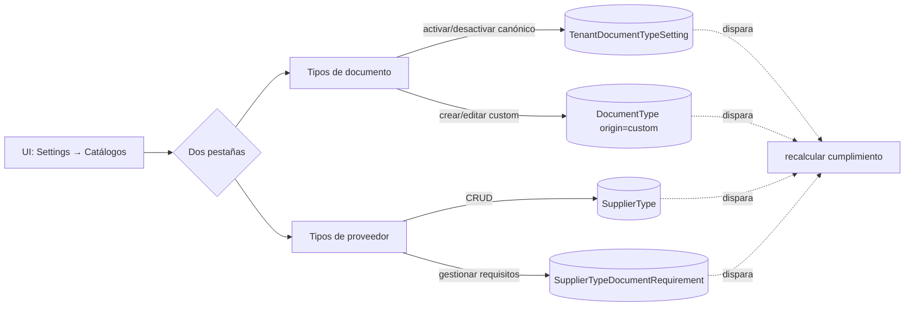

# Phase 1 Data Model: Administración de Catálogos

**Sin cambios al schema relacional**. Este spec consume y administra entidades ya definidas en el [data-model del 001](../001-repse-compliance-tracker/data-model.md):

| Entidad | Definida en | Rol en 003 |
|---------|-------------|------------|
| `DocumentType` | 001 §"DocumentType (catálogo canónico)" | Lectura + escritura (crear/editar custom; activar/desactivar canónicos vía `TenantDocumentTypeSetting`). |
| `TenantDocumentTypeSetting` | 001 | Lectura + escritura para activar/desactivar canónicos por tenant. |
| `SupplierType` | 001 §"SupplierType" | Lectura + escritura (CRUD del catálogo de tipos de proveedor). |
| `SupplierTypeDocumentRequirement` | 001 §"SupplierTypeDocumentRequirement" | Lectura + escritura (asociación + override de periodicidad). |
| `AuditLog` | 001 | Append-only para todos los cambios del spec 003. |
| `Notification` | [spec 002](../002-compliance-alerts/data-model.md) | Reusada para notificar al admin cuando se agrega un canónico nuevo (FR-012). Ver [research §1](./research.md#1-notificación-al-admin-cuando-aparece-un-canónico-nuevo). |

---

## Reglas operativas (no son DDL pero son parte del modelo de dominio)

### "Sin clasificar" inmutable

- `SupplierType.origin = 'system'` solo se asigna al provisioning del tenant (FR-013 del spec).
- Los servicios de `update_supplier_type`, `archive_supplier_type` y `delete_supplier_type` rechazan con `403 system_type_immutable` cuando el target tiene `origin='system'`.
- Lo mismo aplica al endpoint correspondiente.

### Recálculo de cumplimiento

- Disparado por: activación/desactivación de tipo, creación/eliminación/archivado de tipo personalizado, CRUD de requisito, override de periodicidad, archivado de `SupplierType`.
- Ejecutado en `FastAPI BackgroundTask`. Idempotente (ver [research §2](./research.md#2-recálculo-de-cumplimiento-tras-cambios-en-el-catálogo)).
- Implementado en `documents/recalculator.py` (módulo del 001).

### Optimistic concurrency

- Toda operación PATCH/DELETE sobre `DocumentType` personalizado, `SupplierType` o `SupplierTypeDocumentRequirement` requiere `If-Match: "<updated_at ISO>"`.
- Si no coincide con la base, responde `409 stale_update` con el cuerpo actual para refresco del cliente.

---

## Diagrama de uso (Mermaid)

---

## Migration

**No hay migration nueva en este spec**. Toda la estructura ya está en el baseline del 001.
